# zeddius-api

Rust/Axum backend for Zeddius.

## Local development

```bash
# Point DATABASE_URL at a Neon instance
sqlx migrate run
cargo run
```

## sqlx offline query cache (`.sqlx/`)

`sqlx::query_as!` normally connects to a live, already-migrated Postgres at `cargo build`
time to type-check each query. The Docker build has no DB access and CI builds the image
*before* running that PR's migrations, so the build instead reads cached query metadata from
`.sqlx/*.json` via `SQLX_OFFLINE=true` (set in the [Dockerfile](./Dockerfile)).

**`.sqlx/` is checked into git.** It is compile-time metadata, not a build artifact — every
machine and CI need it to type-check without a live DB.

### TODO for every new query or schema-affecting migration

Re-run this locally (against a real, migrated `DATABASE_URL`) and commit the result:

```bash
cargo install sqlx-cli --no-default-features --features rustls,postgres  # once
cargo sqlx prepare
```

If you forget, the build fails with "no cached data for this query" rather than silently
using stale metadata — but it's easy to forget, so treat it as part of the change whenever
`src/**/repo.rs` or `migrations/` changes.

## CI/CD

Three GitHub Actions workflows in `.github/workflows/`:

- **`development.yml`** — on PR to `main`: fmt/clippy/test, build+push image, run migrations,
  deploy to the dev Cloud Run service.
- **`production.yml`** — on PR merge to `main`: build+push a version-tagged image, tag the
  release, bump the patch version. Does not deploy.
- **`deploy.yml`** — manual dispatch: run migrations and deploy a specific version to
  `development` or `production`.

Deploys to Cloud Run on GCP (`zeddiusdev` / `zeddiusprod` projects), authenticated via
Workload Identity Federation. Database is Neon Postgres.

## API endpoint flows

Every branch below is what the code actually does, not just the happy path. `AuthUser` means
the endpoint requires a valid bearer token only (identity, any verification status). `VerifiedUser`
additionally requires `email_verified_at` to be set. Endpoints with neither are unauthenticated.

### `GET /health`

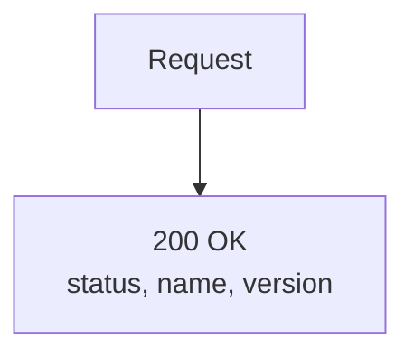

### `POST /auth/register`

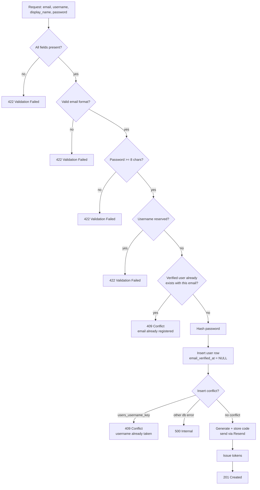

### `POST /auth/login`

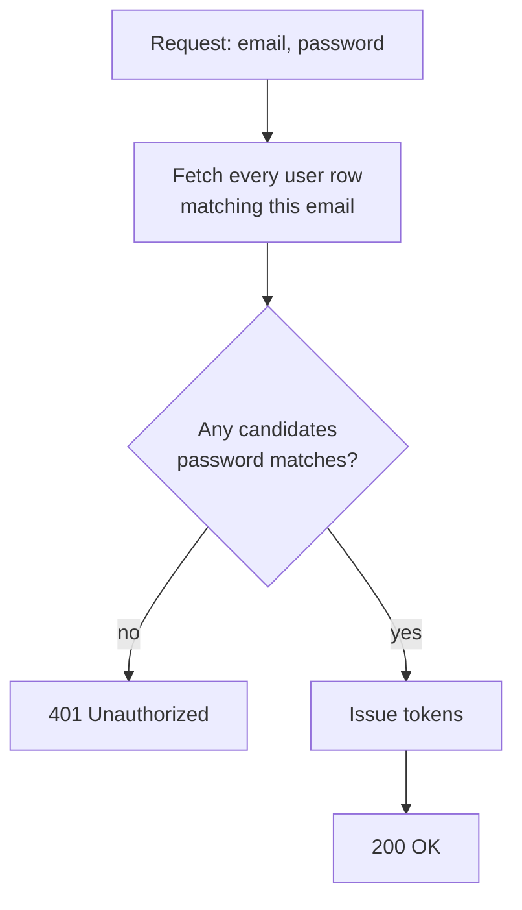

More than one unverified row can share an email, so this checks the password against every
candidate rather than trusting a single, arbitrarily-picked match.

### `POST /auth/refresh`

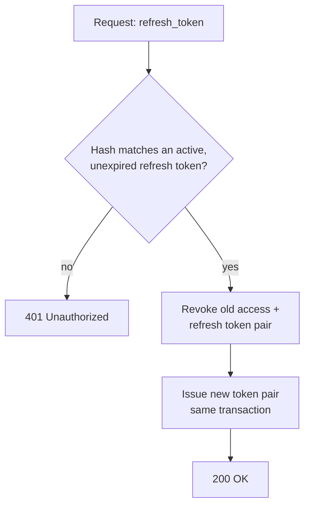

### `POST /auth/logout` — `AuthUser`

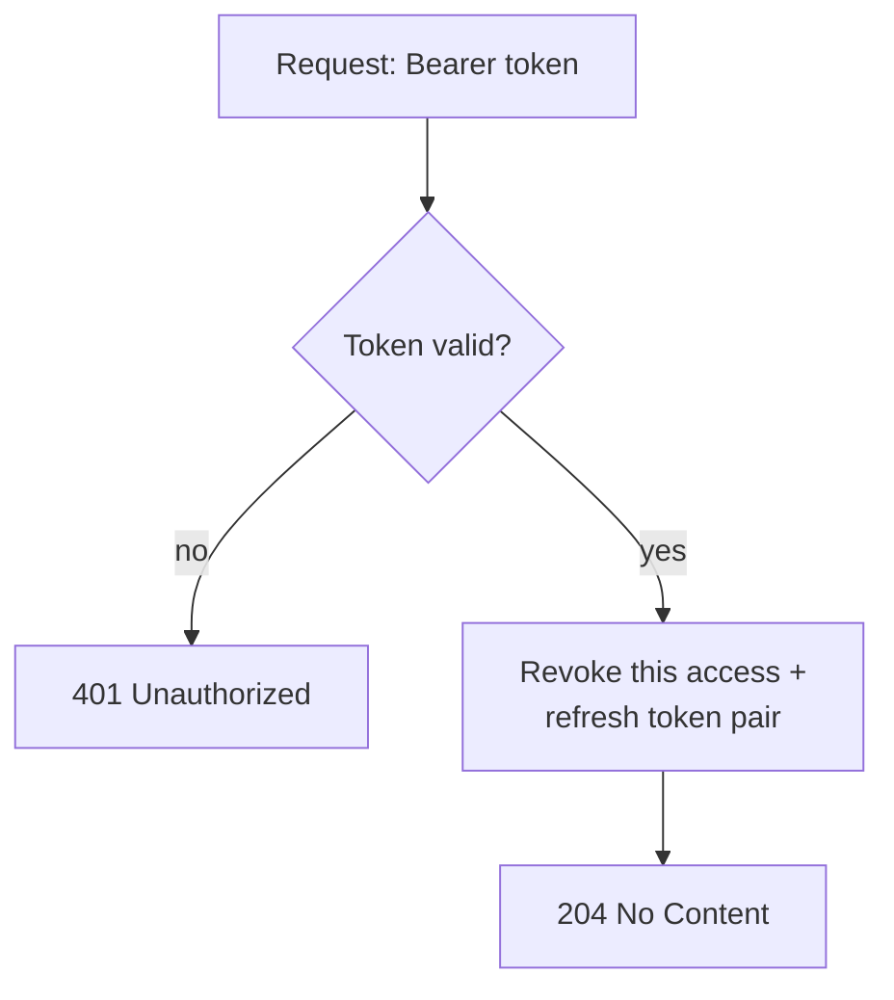

### `GET /auth/sessions` — `AuthUser`

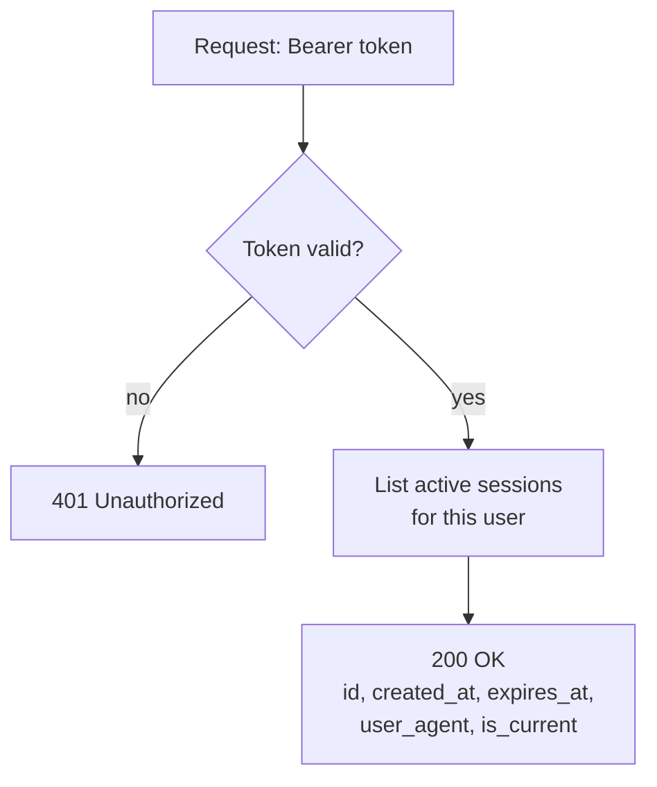

### `DELETE /auth/sessions` — `AuthUser`

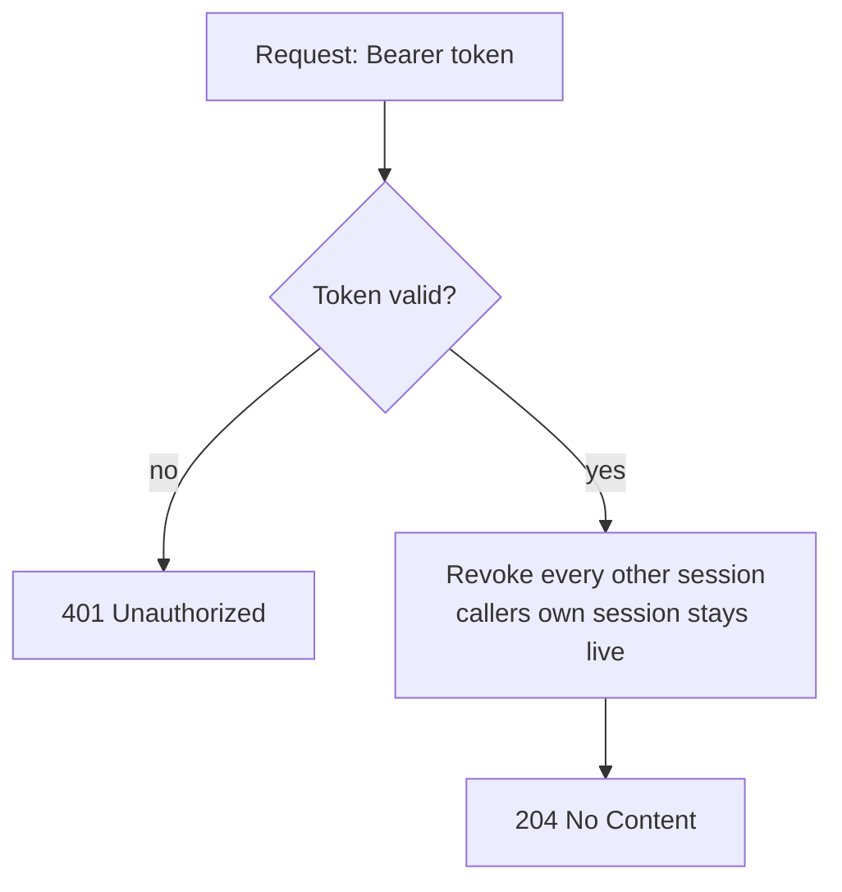

### `POST /auth/verify-email` — `AuthUser`

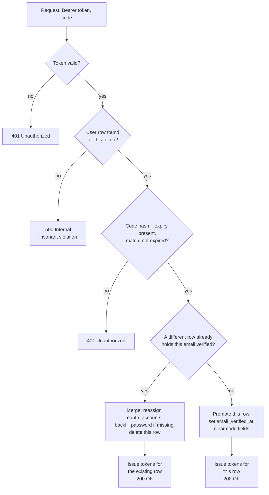

### `POST /auth/resend-verification` — `AuthUser`

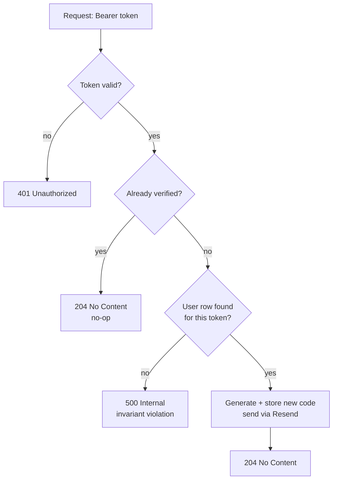

### `POST /auth/oauth/apple`

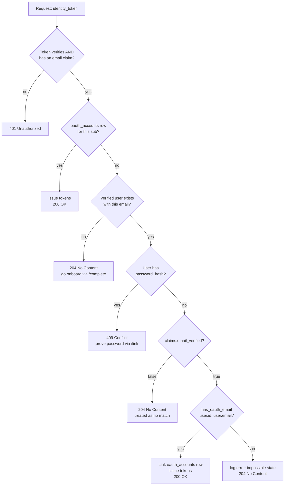

### `POST /auth/oauth/apple/complete`

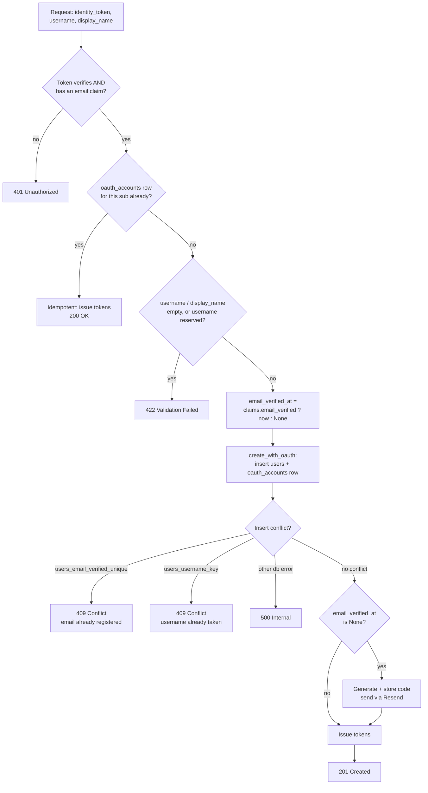

### `POST /auth/oauth/apple/link`

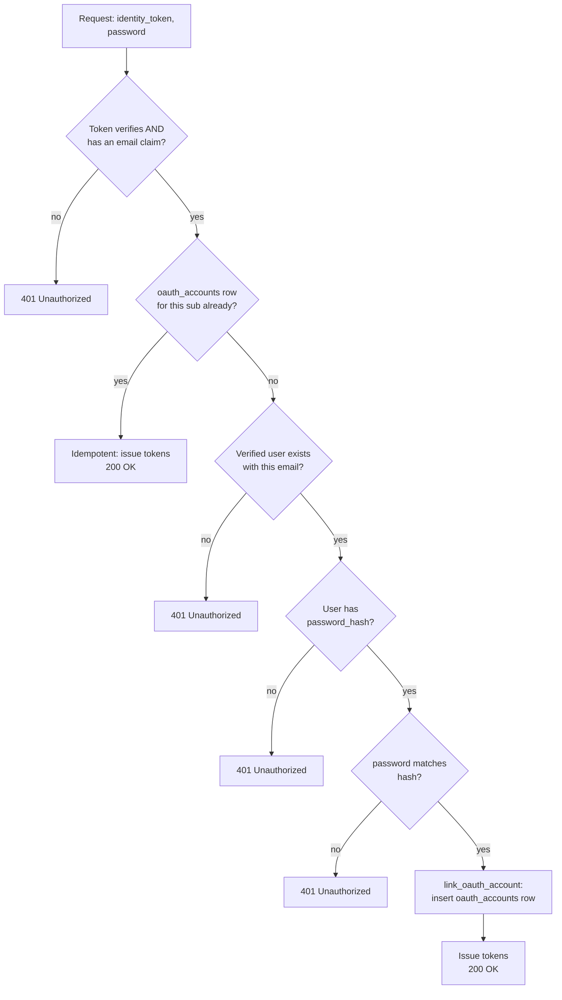

`oauth_apple_link` deliberately collapses three different failure reasons (no verified
account, no password on the account, wrong password) into the same `401` — the same
anti-enumeration reasoning as `login` never distinguishing "no such account" from "wrong
password."

### `GET /auth/username/{username}/available`

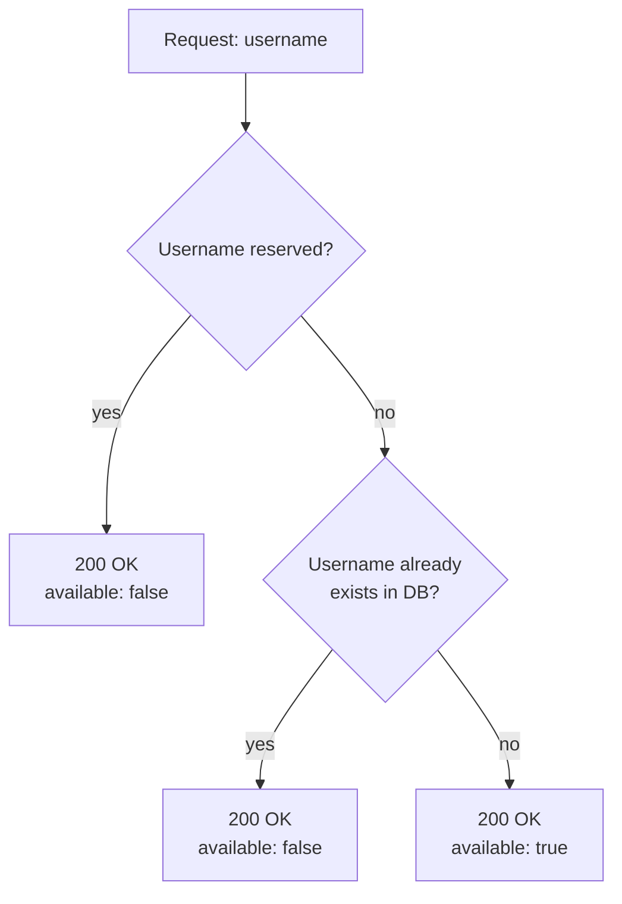

### `GET /users/me` — `VerifiedUser`

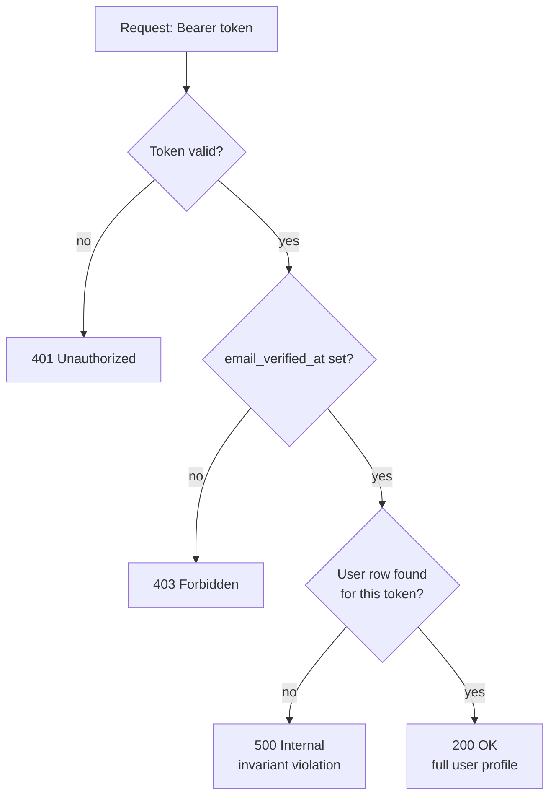
